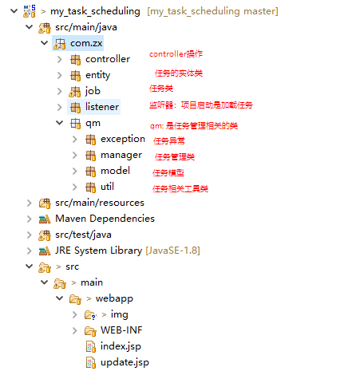
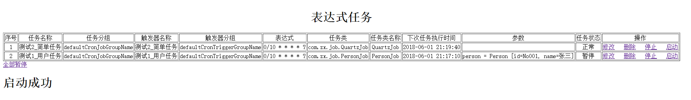
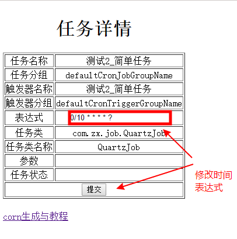

# 项目介绍

简单的任务调度功能，支持定时任务创建、删除、修改、监控、启动和暂停等。

满足一般项目的

# 软件架构

# 安装教程

1. clone https://gitee.com/zx19890628/my_task_scheduling.git
2. import 项目(as maven project)
3. 部署到Tomcat7中即可使用。(tomcat8会出现乱码)

# 程序流程

1. 项目启动时InitJobBean类会加载两个定时任务
2. 访问 http://127.0.0.1:8080/allJob 进入管理界面

# 参与贡献

1. Fork 本项目
2. 新建 Feat_xxx 分支
3. 提交代码
4. 新建 Pull Request

# 码云特技

1. 使用 Readme\_XXX.md 来支持不同的语言，例如 Readme\_en.md, Readme\_zh.md
2. 码云官方博客 [blog.gitee.com](https://blog.gitee.com)
3. 你可以 [https://gitee.com/explore](https://gitee.com/explore) 这个地址来了解码云上的优秀开源项目
4. [GVP](https://gitee.com/gvp) 全称是码云最有价值开源项目，是码云综合评定出的优秀开源项目
5. 码云官方提供的使用手册 [http://git.mydoc.io/](http://git.mydoc.io/)
6. 码云封面人物是一档用来展示码云会员风采的栏目 [https://gitee.com/gitee-stars/](https://gitee.com/gitee-stars/)